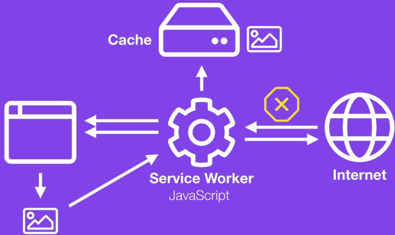
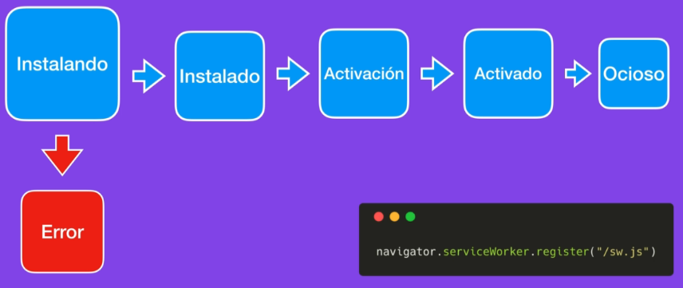
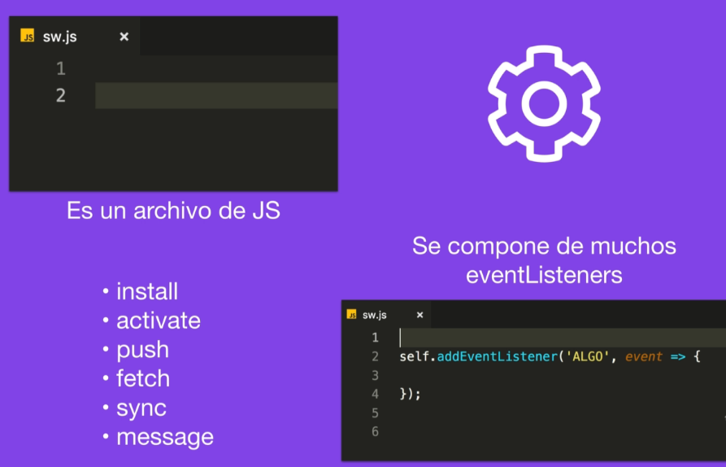

# [⬅](../README.md) Conceptos clave de las PWA

## HTTPS

Las PWA tienen que ser servidas bajo el protocólo HTTPS, por lo cual será necesario contar con un certificado con el fin de proteger nuestro sitio o aplicación.

## Service Worker

Es un archivo javascript que funciona como proxy entre nuestra aplicación web e internet, este archivo se ejecuta en el background, es decir, en un hilo independiente de la aplicación.

### Ciclo de vida de un Service Worker

#### Instalando
- Se descarga el archivo Javascript
- El archivo es revisado
- Entra en fase de instalación

Si este proceso falla el SW se pierde, en caso de que todo esté correctamente, el SW entra al siguiente paso de _Instalando_.

#### Instalando o Esperando (Waiting)
- Entra al siguiente paso de _Activación_ en caso de que no exista otro SW en ejecución.
- Si existe otro SW, se espera a que todas las pestañas sean cerradas para poder entrar al siguiente paso.

#### Activación
- Esta se ejecuta antes de que el SW tome el control de la aplicación.

#### Activado
- El SW toma el control de la aplicación según el alcance que se haya programado.

#### Ocioso
- Este paso sucede cuando el SW falla en la instalación o es reemplazado por una nueva versión.

### Escucha de Eventos
El SW puede escuchar los siguientes eventos:
- install
- activate
- push
- fetch
- sync
- message

